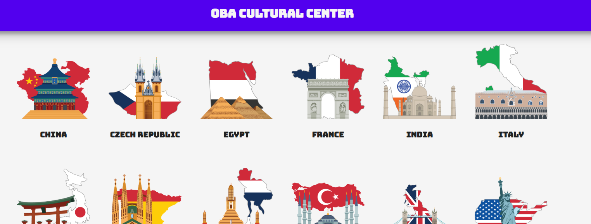

# OBA Cultural Center

OBA Cultural Center is a tool that helps students with picking a subject for their project/essay in an interactive way.

## Live Link
[Demo](https://mich97.github.io/project-1-1920/)

## Features
- Clicking on one of the categories (countries) fetches 10 books of the chosen category
- Results get put in a slider, user can slide through the books
- Clicking on a book opens a detailpage, showing more information of the chosen book
- Displays loading states inbetween browsing through the application

## API
This web-app is made by making use of the OBA API. The API implements a throttling mechanism that can be configured per-public key. There is also an overall limit on the number of open API requests, which hasn't been specified. Documentation can be found [here](https://zoeken.oba.nl/api/v1/).

## Design Patterns JS
- Arrow functions
- Camel casing
- Tabs to space code
- Occasional but minimal whitespace
- No 'var'
- ES6

## Wishlist
- [x] Fetching books with keyword from category
- [x] Display results in some nicer way than grid/list
- [x] Detailpage
- [x] General styling
- [x] Loading states
- [ ] Background image depending on chosen category
- [ ] SVG images
- [ ] Filter unwanted results